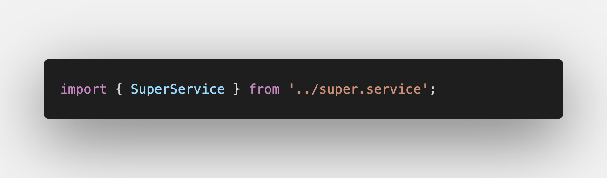

# En singleton som ikke vil

En service i Angular kan opptre som en singleton i applikasjonen, altså så at det kun opprettes en instans av den, hvis providedIn egenskapen settes til 'root':

```javascript
import { Injectable } from '@angular/core';

@Injectable({
  providedIn: 'root',
})
export class SomeService {}
```

(evt. inkludert i AppModule pre angular 6)
[Singleton services i angulardokumentasjonen](https://angular.io/guide/singleton-services)

Dette er forventet adferd. Så når dette ikke var tilfelle under dagens jobbkoding skapte det en anseelig mengde hodebry. Jeg hadde ett objekt i en service som kun sporadisk ble oppdatert. Som relativt uerfaren angularutvikler ga ikke dette noen mening for meg.

Etter nærmere etterforskning viser det seg at innholdet i det aktuelle objektet varierer etter hvor i applikasjonen metodene invokeres. Jeg henter inn servicen i flere komponenter, men det skal jo ikke ha noe å si? _providedIn_ er satt til _root_ ihht til dokumentasjonen. Usikkerheten eksploderer og jeg roter rundt og prøver tilfeldige ting, trykker meg gjennom debuggeren linje for linje, igjen og igjen.

## Det logiske neste steg...

Er selvfølgelig å spørre en voksen om hjelp. Slacker opp en erfaren kollega. Deler skjerm. Han deler mitt tankesett vedrørende service som singleton. Vi utelukker typos og tullefeil da jeg er en flittig bruker av CLIen og import skjer vha (ctr + .).

Den erfarne kollega spekulerer og forespør i en bisetning om det er forkjsell på url i importen i de to forskjellige komponentene hvor servicen brukes.

### Lo and behold

**_Komponent 1_**


**_Komponent 2_**


Det var altså en .js endelse som ødela for meg! Den får på en eller annen måte Angular til å ikke kjenne igjen servicen og instantierer den på nytt.


